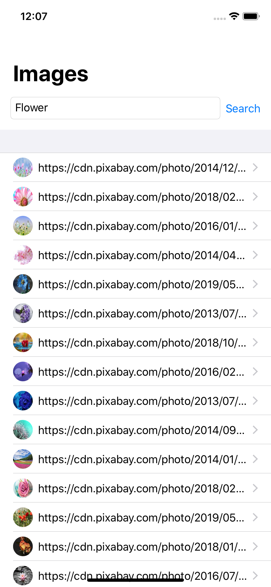

# MVVM with SwiftUI & Combine

Before WWDC 2019, most of MVVM implementations use some popular reactive framework such as RxSwift, ReactiveSwift or ReactiveKit along with their UI Binding counterparts such as RxCocoa, ReactiveCocoa or Bond.

In WWDC 2019, Apple introduces two awesome frameworks which replace those frameworks to provide reactive programming and UI Binding completely. From now own, developers can implement MVVM architecture for their apps using only native frameworks which provide many benefit such as stability, binary app size and consistent APIs etc...

This project demonstrate how to implement MVVM using `SwiftUI` and `Combine` to search and display images from pixabay.com. There are also some tests to demonstrate the testability of the implementation.

Required Xcode 11 to compile.

MIT License.